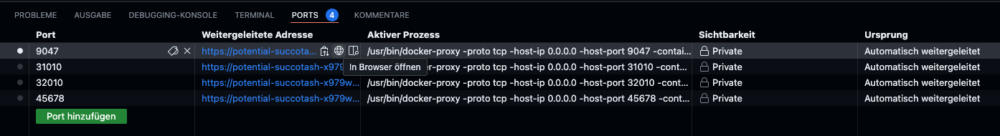

# Data Virtualization Primer

## Data Virtualization 

According to [Wikipedia](https://en.wikipedia.org/wiki/Data_virtualization):

*Data virtualization* is an approach to *data management* that allows an application to *retrieve* and *manipulate* data 
*without* requiring technical *details* about the data, such as *how* it is *formatted* at source, or *where* it is 
physically *located* [1](https://en.wikipedia.org/wiki/Data_virtualization#cite_note-1) and can provide a single customer view 
(or single view of any other entity) of the overall data [2](https://en.wikipedia.org/wiki/Data_virtualization#cite_note-2).

## Related Topics

- [Linked](https://docs.oracle.com/en/database/oracle/oracle-database/19/sqlrf/CREATE-DATABASE-LINK.html) and [Federated](https://en.wikipedia.org/wiki/Federated_database_system) Databases
- [Distributed](https://en.wikipedia.org/wiki/Distributed_database) and [Not-Only-SQL](https://en.wikipedia.org/wiki/NoSQL) Databases
- [Virtualization](https://en.wikipedia.org/wiki/Virtualization) & [Cloud Computing](https://en.wikipedia.org/wiki/Cloud_computing)
- [Data Mesh](https://en.wikipedia.org/wiki/Data_mesh)
- [Big Data](https://en.wikipedia.org/wiki/Big_data) & [Data Lakes](https://en.wikipedia.org/wiki/Data_lake)
- [Business Intelligence](https://en.wikipedia.org/wiki/Business_intelligence) & [Data Warehouses](https://en.wikipedia.org/wiki/Data_warehouse)

## Advantages of Data Virtualization

- Keeps control by the source party (department, company)
- Reduces the (even: legal) risk of redundant, old or erroneous data
- Reduces the workload for copying/moving data
- Does not presuppose or impose a single data model / schema / format
- Supports transactional reading and writing
- Allows to analyze across multiple domains

## Challenges of Data Virtualization

- Differences in source and consumer formats and semantics
- Declarative approach based on the target outcome
- Adapting to changing environments (source and target)
- Networking stability to the source systems
- Variying qualities of source data 
- Managing the security and privacy of the source data

## Data Virtualization Concepts

### Abstraction

Abstract the technical aspects of stored data, such as location, storage structure, API, access language, and storage technology.

### Virtualized Data Access

Connect to different data sources and make them accessible from a common logical data access point.

### Transformation

Transform, improve quality, reformat, aggregate etc. source data for consumer use.

### Federation

Combine result sets from across multiple source systems.

### Delivery

Publish result sets as views and/or data services executed by client application or users when requested.

## Lets make an example

### Run Data and Virtualization Services

Type in the following command in your terminal

```console
docker compose up
```


If you run docker on your local computer, you may open [http://localhost:9047](http://localhost:9047) in your browser.
If you run docker in Codespaces, you should open the forwarded address for port `9047`.



### Setup the Data Virtualizer

When you run dremio for the first time, you have to enter some admin account details.


Then you will see an empty workspace which has no 
- Spaces (which is the equivalent of "views" or "output schemas")
- Sources (which is the equivalent of "tables" or "input schemas")


### Add a (Public, Internet, Big) Data Source

Next we will create a source which points to an open dataset 


which is located in a public S3 bucket


For each source (connection) you can enable various options to optimize the
scanning (both meta-data and data). These settings allow to specifiy a sweet spot between
changing sources and caching the raw data access.


Finally, we declare a folder or a file to contain a data (table) and 
propose a format.


Afterwards, we can immediately preview the data which describes individual taxi trips in New York City.


### Add a (Internal, Classic, Small) Data Source

Now, let us add another source, this time to a "local" database.


Again, you can browse through all available tables


and preview the content of the table which describes the weather conditions on individual days in New York City.


### Transform and Publish Federated Views

To publish a special analysis which we will perform to bring together the (public) taxi trips and the (private) weather conditions,
we first create a new output space.


In that space, we will then create a view which uses SQL to mangle the two sources

```sql
CREATE OR REPLACE VIEW "New York"."TripWeather" AS 
    SELECT trips.*, weather.*
      FROM "New York Taxi Trips"."samples.dremio.com"."NYC-taxi-trips" AS trips
      JOIN "New York City Weather".public."nyc_weather" AS weather
        ON (weather."date" = DATE_TRUNC('DAY',trips."pickup_datetime"))
```


Since the resulting view will be used in analytic settings, we may specify "dimensional" reflections (i.e. pre-aggregated cache tables) which will speedup any query afterwards. Note that reflections will be refreshed (upon some settings) when the sources change.


Finally, we can make a correlation analysis between the maximal temperature at a certain day and the average cost (including tips) of the taxi trips.
There is a maximum at 68.0 degree fahrenheit.

```sql
SELECT 
    FLOOR("tempmax"/2.0)*2.0 AS "TEMP", 
    SUM("total_amount")/COUNT(*) AS AVG_INCOME 
  FROM "New York".TripWeather 
 GROUP BY FLOOR("tempmax"/2.0)
 ORDER BY FLOOR("tempmax"/2.0) ASC
 ```


## Products and Resources

### Products

- Dremio [https://www.dremio.com/](https://www.dremio.com/) - Hybrid Lakehouse
for the Business
- Denodo [https://www.denodo.com](https://www.denodo.com) - Data at the Speed of Business.
- TIBCO [https://www.tibco.com/](https://www.tibco.com/) - Real-time data fuels the modern enterprise
- Databricks [https://www.databricks.com/](https://www.databricks.com/) - Your data. Your AI.
Your future.
- JBoss Data Virtualization [https://access.redhat.com/products/red-hat-jboss-data-virtualization](https://access.redhat.com/products/red-hat-jboss-data-virtualization)

### Resources

- Apache Drill [https://drill.apache.org/](https://drill.apache.org/) - Schema-free SQL Engine
- Apache Arrow [https://arrow.apache.org/](https://arrow.apache.org/) - Toolbox for fast data interchange and in-memory analytics
- Linked Data [https://en.wikipedia.org/wiki/Linked_data](https://en.wikipedia.org/wiki/Linked_data) - Semantic World-Wide Web